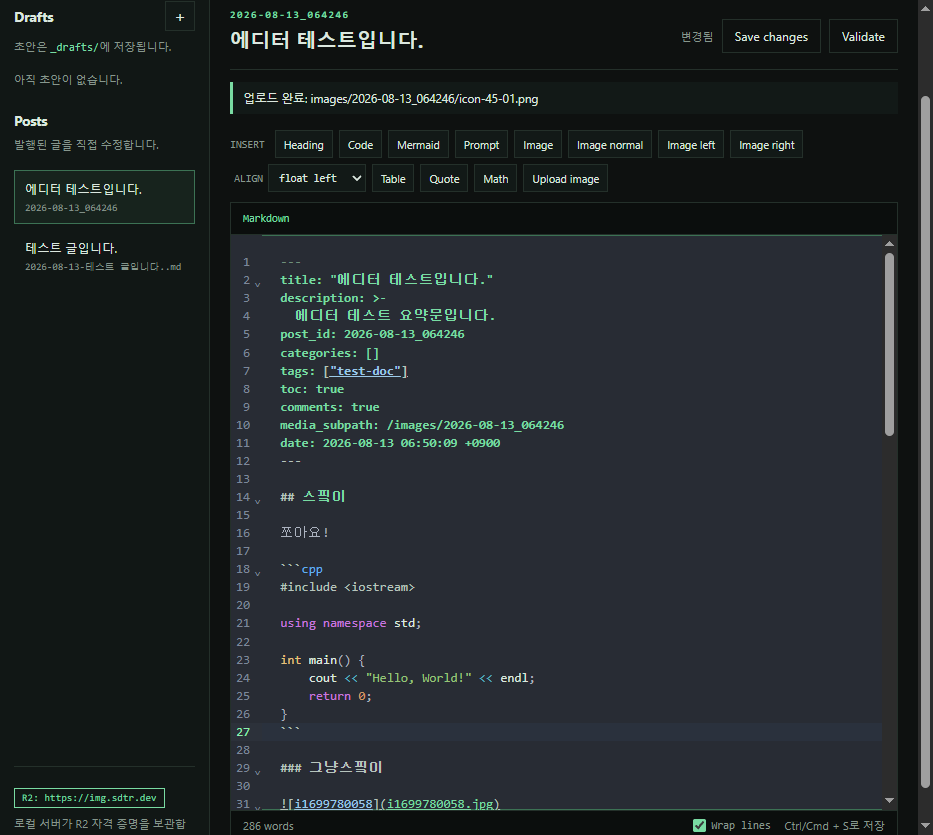
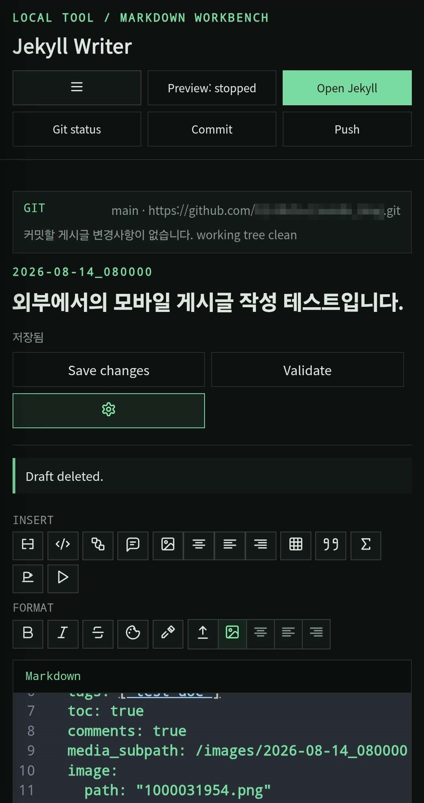

# Jekyll Markdown Writer
<div align="center">



[](https://github.com/cotes2020/jekyll-theme-chirpy)
[](https://www.cloudflare.com/ko-kr/developer-platform/products/r2/)

</div>


Jekyll 블로그용 로컬 Markdown 편집기입니다.

- `_drafts/`, `_posts/` 글 작성 및 관리
- Markdown·코드 편집과 자주 쓰는 문법 삽입
- 게시글 설정, 기본 검사, Jekyll 미리보기
- AI description 생성 및 Cloudflare R2 이미지 업로드

## 빠른 시작

`tools/blog-writer`를 Jekyll 저장소 안에 둡니다.

```text
my-blog/
├─ _config.yml
├─ _posts/
├─ _drafts/
└─ tools/
   └─ blog-writer/
```

도구 폴더에서 실행합니다.

```powershell
Copy-Item .env.example .env
npm install
npm start
```

Windows에서는 `start.cmd`를 실행해도 됩니다. 이후 <http://127.0.0.1:4170>을 엽니다.

도구를 다른 위치에 두려면 `.env`의 `JEKYLL_ROOT`에 대상 Jekyll 저장소 경로를 지정합니다.

## 사용법

1. `New draft`에서 제목과 필요한 메타데이터를 입력해 초안을 만듭니다.
2. Markdown을 작성하고 `Save` 또는 `Ctrl/Cmd + S`로 저장합니다.
3. `Validate`로 문법을 확인합니다.
4. `Preview`와 `Open Jekyll`로 실제 페이지를 확인합니다.
5. 완료되면 `Publish`로 `_posts/`에 발행합니다.

왼쪽 `Posts` 목록에서 기존 글을 열어 수정할 수 있습니다.

<details>
<summary>선택 기능 및 추가 설정</summary>

### 환경 변수

기본값으로 실행되지 않는 Jekyll 저장소만 `.env`에서 경로를 지정합니다.

```text
JEKYLL_ROOT=
JEKYLL_DRAFTS_DIRECTORY=_drafts
JEKYLL_POSTS_DIRECTORY=_posts
JEKYLL_PORT=4000
BLOG_WRITER_PORT=4170
```

### 이미지 업로드

아래 값을 `.env`에 설정한 뒤 `Upload image`를 사용합니다.

```text
R2_ACCOUNT_ID=
R2_ACCESS_KEY_ID=
R2_SECRET_ACCESS_KEY=
R2_BUCKET=
R2_PUBLIC_BASE_URL=
R2_JURISDICTION=default
```

`Upload image or video` accepts images and common video files. Images are inserted as Markdown; videos are inserted with the Jekyll `embed/video.html` include. Each file is limited to 20 MB, and multiple files are uploaded sequentially.

이미지는 다음처럼 저장됩니다.

```text
images/YYYY-MM-DD_HHMMSS/파일명.ext
```

R2 비밀값은 `.env`에만 저장하고 Git에 커밋하지 마세요.

### AI description

`Post settings`에서 provider·model·API key를 설정한 뒤 `Auto generate`를 누릅니다. API key는 `.env`에 저장할 수도 있습니다.

```text
AI_PROVIDER=gemini
AI_MODEL=gemini-3.5-flash-lite
AI_API_KEY=your-gemini-api-key
```

### 기타

코드블록·미디어·프롬프트·대표 이미지 등은 편집기의 각 삽입 버튼에서 사용할 수 있습니다. Git 기능을 사용하려면 `JEKYLL_ROOT`를 블로그 저장소로 지정한 뒤 `Git status → Commit → Push` 순서로 실행합니다.

</details>

## 라이선스

[`THIRD-PARTY-NOTICES.md`](THIRD-PARTY-NOTICES.md)
